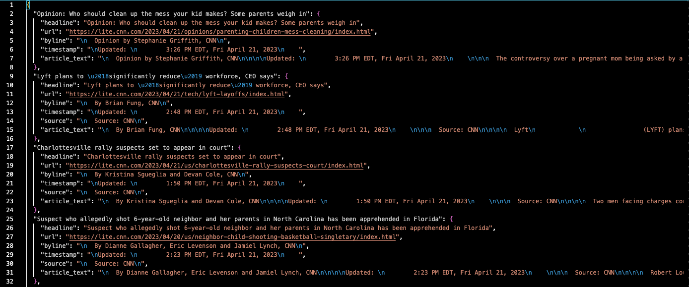

# cnn_scraper.py

# Description
This module contains functions for scraping the CNN Lite site at https://lite.cnn.com.

# Usage
```bash

# install requirements (requests and beautifulsoup)
>>> pip install -r requirements.txt

# export today's news to json document in local folder
>>> python cnn_scraper.py
```

#### Sample CNN Lite Home Page and Output JSON

